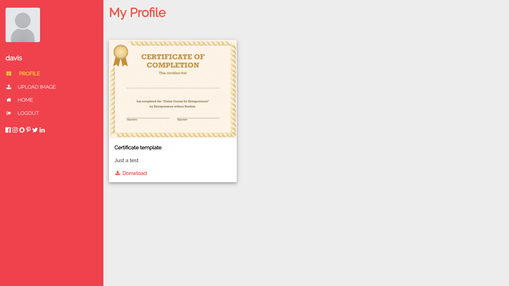
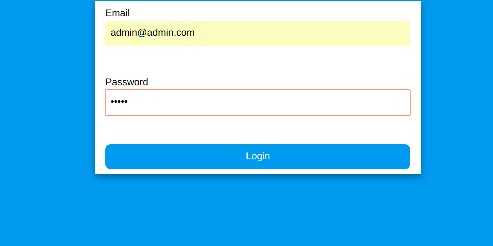
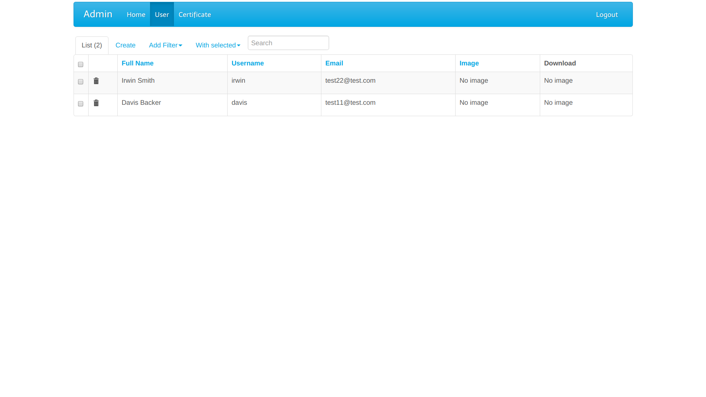
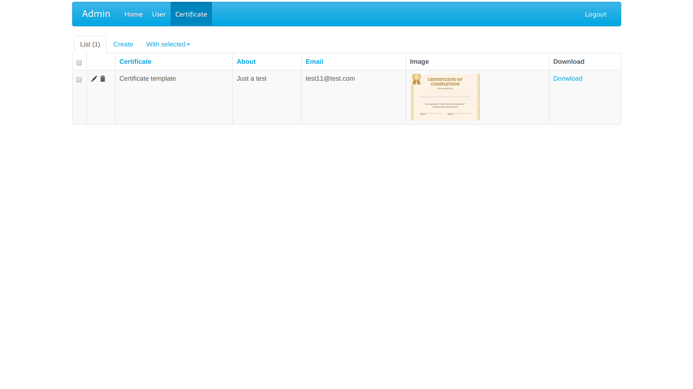
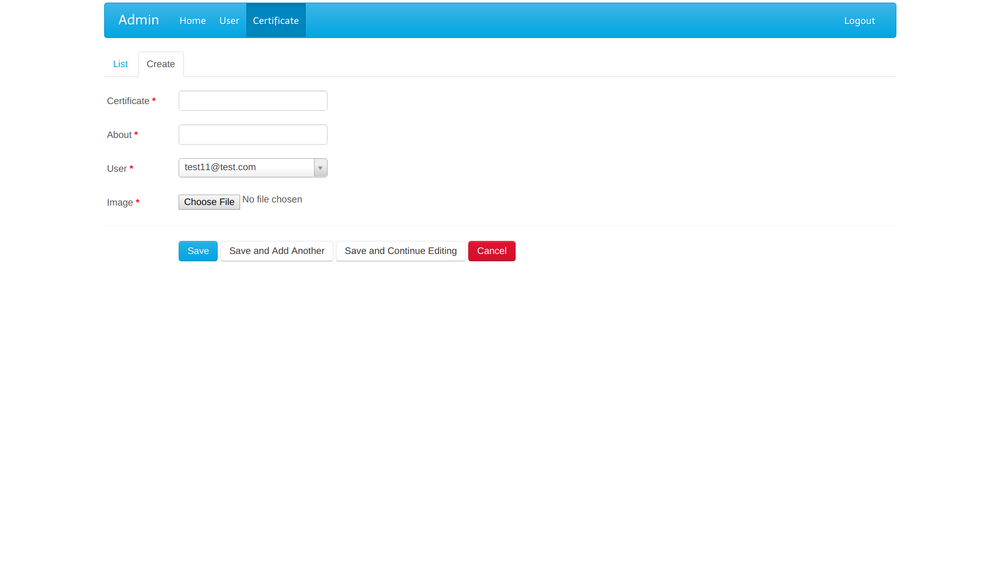

# Certificates

A small website built with flask.There is users and an admin.
The admin can add certificates to the users so they can login and download their certificates.


## Getting Started

### Prerequisites
 python 3 

### Installing
 Clone the project : 
 
 
 
```
 git clone https://github.com/mohammedhashim44/Certificates-Flask-Project.git
```

 Install the libraries listed in requirements.txt file .

```
 cd Certificates-Flask-Project
 pip3 install -r requirements.txt
```

## Running the project

to run the project , do :

```
 cd Certificates-Flask-Project 
 cd app 
 python3 app.py 
```

## How to use 
  #### The user end
  -When you run the project , the server will be running on localhost:5000 <br/>
  -Open the browser and go ```http://localhost:5000/```<br/>
  -You can sign in with example account ```email:test11@test.com  password:test``` <br/>
  -You will be directed to the profile page  <br/>
  -You can upload your image <br/>
  -You can view your certificates and download them <br/>
  
  ##### Shots : 
<p align="center">
   
 <br/>
    
<br/>
</p>


  
  #### The admin end
  -Go to ```http://localhost:5000/admin```<br/>
  -Sign in with the account ```email:admin@admin.com  password:admin``` <br/>
  -You will be directed to the dashboard  <br/>
  -You can create , edit or delete users and certificates  <br/>
  -To add user , go to user tab and press create and fill the form  <br/>
  -To add certificate to certain user , go to certificates tab and press create and fill the form <br/>
 
   ##### Shots :
<p align="center">
   
 <br/>
   
 <br/>
    
<br/>
     
<br/>
</p>

   

## Contents
- ```app``` folder :
    - ```app.py``` contains the defenistions of routes and app configurations , it's the main file . 
    - ```model.py``` contains the SQLalchemy table models and event listeners . 
    - ```DatabaseHelper.py``` contains functions to handle insertion into the database .
    - ```myAdmin.py``` contains the views of the admin dashboard . 

-```static``` folder : 
    - ```certificates``` the folder where the certificates images will be saved . 
    - ```user_images``` the folder where the users images will be saved
    - ```css``` the folder contains css styles 

- ```templates``` : contains html templates
    
    
## Security 

For security , no user can view the images or certificates of another user . 
To implement this , each user has an ID , for eexample we have ```username:test ID:1``` .
<br/>
When the user upload photo or the admin upload new certificate for this user , a prefix string contains the ID of the user  will be added to the name of the image , if the image is ```cert.jpg``` it will be ```ID-1-cert.jpg``` .<br/>
If the user enter ```certificates/ID-1-cert.jpg``` , the server will compare the current user ID string (```ID-{{current_user_id}}```) with the string in the image name , if it finds a match the user can view the image , else it will not be viewd . 


## Built With

* [Flask](http://flask.pocoo.org/) - The web framework used
* [Flask-Admin](https://flask-admin.readthedocs.io/en/latest/) - Dashboard extension
* [Flask_SQLAlchemy](http://flask-sqlalchemy.pocoo.org/2.3/) - Sqlalchemy database
* [Jinja2](http://jinja.pocoo.org/docs/2.10/) - Template engine
* [Flask-Uploads](https://pythonhosted.org/Flask-Uploads/) - Upload files
* [WTForms](https://github.com/wtforms/wtforms) - Forms validation and rendering
* [W3schools.com](https://www.w3schools.com/) - HTML templates

 
## License

This project is licensed under the MIT License - see the [LICENSE.md](LICENSE.md) file for details


